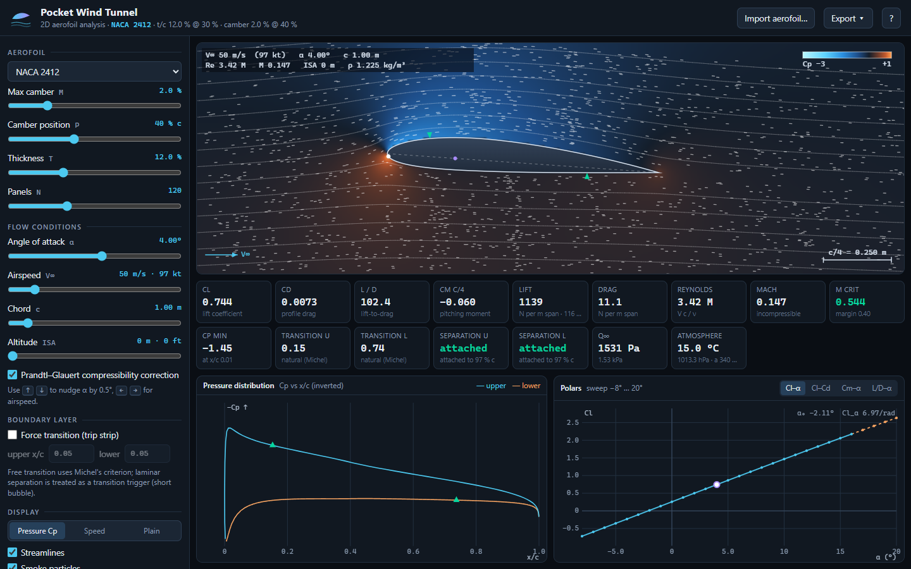
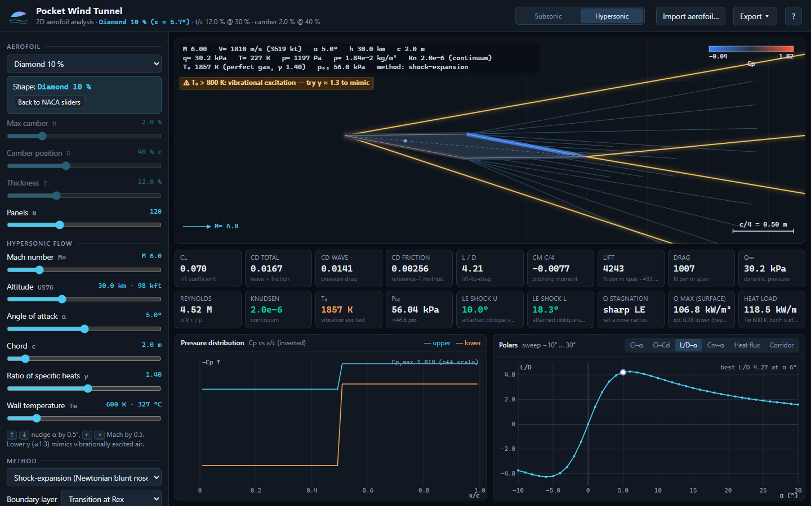
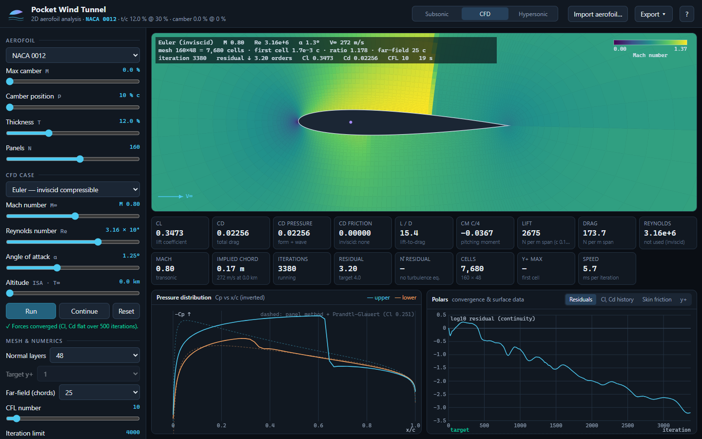
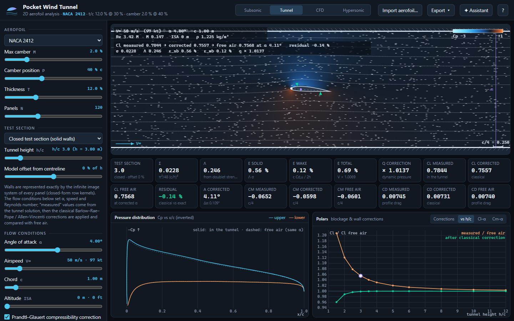
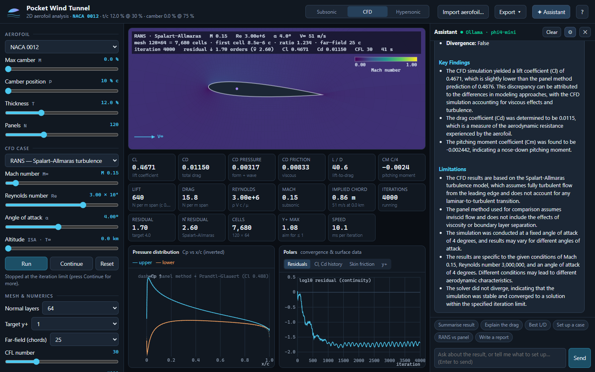

# Pocket Wind Tunnel

A 2D aerofoil wind tunnel in a single HTML file. Open **`Pocket Wind Tunnel.html`** in any modern browser — no
installation, no internet, no libraries. It runs happily from a USB stick or an air-gapped laptop.











## What it does

* **Any section** — NACA 4-digit family from three sliders, 18 presets, or import a UIUC `.dat` coordinate file
  (Selig or Lednicer format) for anything else: Clark Y, Eppler, Selig, supercritical sections…
* **Live flow field** — pressure-coefficient or speed colour map, streamlines, and smoke particles advected through
  the real velocity field. Hover anywhere for the local Cp and velocity.
* **Real numbers** — Cl, Cd, L/D, Cm about the quarter chord, lift and drag per metre span, Reynolds and Mach numbers,
  critical Mach, peak suction, transition and separation points on both surfaces.
* **Pressure distribution** — Cp vs x/c with transition/separation markers and the sonic Cp* line when compressible.
* **Polars** — Cl–α, drag polar, Cm–α and L/D–α swept automatically from −8° to 20°, with zero-lift angle and
  lift-curve slope; separated points are drawn dashed.
* **Flight conditions** — airspeed, chord and ISA altitude to 20 km set Re and Mach; optional Prandtl–Glauert
  compressibility correction; optional trip strip to force transition.
* **Export** — Cp, polar and boundary-layer CSVs, the coordinates as an XFOIL-ready `.dat`, or a PNG of the tunnel view.

## Test-section mode — wall interference and blockage

The **Tunnel** switch puts the section between the walls of a 2D test section and solves the flow exactly: every
panel's source and vortex is reflected in both walls (two infinite image rows per singularity, summed in closed
form), so the wall condition holds to machine precision. You see the tunnel flow field, the "measured" Cp, Cl, Cm
and Cd at the geometric incidence, the classical corrections (σ, shape factor Λ from the section's own doublet
strength, solid and wake blockage, streamline curvature — Barlow, Rae & Pope / Allen & Vincenti) and the free-air
solution at the corrected incidence for comparison. Tabs show the correction bars, the lift error versus h/c before
and after correction, and tunnel-vs-free polars. Closed sections and open jets; model offset from the centreline.

`node test/validate-tunnel.js`: wall normal velocity < 10⁻¹⁴; cylinder blockage within 3 % of the exact doublet-row
result; Λ = 4.03 vs 4 exact for a cylinder, 0.235 for a NACA 0012 (charts ≈ 0.2–0.3); classical corrections recover
free air within 0.3–0.6 %.

## Assistant (optional, local LLM)

The **✦ Assistant** button (or Ctrl+K) opens a chat panel backed by a language model running on your own machine —
Phi-4 Mini through Ollama by default (3.8 B parameters, Q4_K_M, ≈2.8 GB VRAM or CPU), or any OpenAI-compatible local
server (llama.cpp `llama-server`, LM Studio). You can set up cases in plain English, run polars and CFD, and have
results explained or written up as a short report.

Design rule: **the model never does physics.** It can only act through six tools that call the app's own solvers —
`get_state`, `set_mode`, `set_geometry`, `set_conditions`, `run_cfd`, `sweep_alpha` — every tool call is shown in the
conversation, and the system prompt instructs it to quote only numbers returned by those tools. Small models still
make wording mistakes; check important conclusions against the tiles.

One-time setup:
1. Install Ollama (ollama.com) and run `ollama pull phi4-mini`.
2. Allow this file to talk to Ollama: in PowerShell `[Environment]::SetEnvironmentVariable('OLLAMA_ORIGINS','*','User')`,
   then quit Ollama from the tray and start it again (a `file://` page sends `Origin: null`, which Ollama blocks by default).
3. Open the panel, press ⚙ → Test.

Privacy: nothing leaves the machine unless you point the server URL somewhere else (the panel warns if you do). The
page works exactly as before without the assistant.

## CFD mode — 2D Navier–Stokes / RANS

The **CFD** switch runs a real compressible Navier–Stokes solver in a Web Worker: the NASA Glenn equation set in 2D
(continuity, x/y momentum, energy) with the **Spalart–Allmaras** turbulence model, on a structured O-mesh generated
around the section in the browser.

* **Models** — Euler (inviscid, handles transonic shocks), laminar Navier–Stokes, RANS with Spalart–Allmaras.
* **Numerics** — cell-centred finite volume; Roe flux with an acoustic-only entropy fix and a low-Mach fix; second-order
  MUSCL/van Albada reconstruction; Green–Gauss viscous gradients; matrix-free LU-SGS implicit time stepping with local
  time steps; characteristic far-field with point-vortex correction; y+-controlled wall spacing.
* **Starts smart** — the run is initialised from the panel-method potential flow plus an analytic boundary layer and a
  log-law ν̃ profile, which removes most of the transient. Typical runs: 5–60 s for 4 000–20 000 cells.
* **Live** — Mach / Cp / pressure / density / speed / temperature / eddy-viscosity / vorticity fields, mesh overlay,
  Cp against the panel-method overlay, residual and force histories, skin friction against the flat-plate laws, y+.
* **Validation** (`node test/validate-cfd.js`, `node test/bench-cfd.js`): inviscid NACA 0012 at M 0.3 within 1 % of
  the panel method + Prandtl–Glauert; transonic AGARD case (M 0.8, α 1.25°) Cl 0.335 / Cd 0.0224 vs 0.35 / 0.022;
  NASA TMR Spalart–Allmaras case (NACA 0012, M 0.15, Re 6×10⁶): Cl 1.12 vs 1.09 at α 10°, Cd 0.0092 vs 0.0082 at α 0.
* **Limits** — steady solutions only; 10–30 k cells, so expect a few percent on lift and 10–20 % on drag against
  fine-mesh codes; fully turbulent (no transition model); keep y+ ≈ 1; accuracy degrades below M ≈ 0.1.

## Hypersonic mode

The **Subsonic / Hypersonic** switch in the header changes the physics to the perfect-gas supersonic/hypersonic
toolkit (Mach 1.5–25, altitude to 86 km, any γ):

* **Methods** — shock-expansion marching with exact oblique-shock and Prandtl–Meyer relations (blunt noses handled
  with modified Newtonian theory up to the sonic point), tangent-wedge, modified and classic Newtonian.
* **Shapes** — flat plate, diamond, wedge, blunted wedge, blunted plate, biconvex, plus any NACA or imported section.
* **Drawn waves** — attached oblique shocks, Billig bow shocks for blunt noses, expansion fans, Mach lines and the
  trailing-edge recompression shock; the surface is colour-banded by Cp, p/p∞, heat flux, local Mach or temperature.
* **Aerothermal** — Eckert reference-temperature skin friction and wall heat flux along both surfaces (laminar,
  turbulent or Re<sub>x</sub> transition, wall temperature as input), Sutton–Graves stagnation heating, heat load per
  metre span, stagnation temperature and pitot pressure, Knudsen number with rarefaction regime, real-gas warnings.
* **Plots** — Cp, polars, heat-flux distribution, and the altitude–velocity flight corridor with constant-q∞ lines.

`node test/validate-hyper.js` checks the relations against NACA Report 1135, Anderson's worked examples, the
US Standard Atmosphere 1976 tables and the exact Newtonian flat-plate result.

## How it works

| Layer | Method |
|---|---|
| Geometry | NACA 4-digit equations with closed trailing edge; cosine panel spacing; arbitrary sections re-panelled by arc-length interpolation |
| Inviscid flow | Hess–Smith panel method: constant-strength source per panel + uniform vortex, Kutta condition; LU-factorised once per geometry |
| Boundary layer | Thwaites (laminar) → Michel transition criterion → Head's entrainment method with Ludwieg–Tillmann skin friction (turbulent); Squire–Young profile drag |
| Atmosphere | ISA to 20 km, Sutherland viscosity |
| Compressibility | Prandtl–Glauert scaling; critical Mach by bisection against isentropic Cp* |
| Hypersonic | US76 atmosphere; exact oblique-shock / Prandtl–Meyer / pitot relations; shock-expansion, tangent-wedge, Newtonian; Eckert reference temperature; Sutton–Graves; Billig |
| CFD | O-mesh generator; Roe/MUSCL finite volume; Spalart–Allmaras; LU-SGS; characteristic far-field; panel-method initialisation |
| Tunnel | Method of images with closed-form row kernels (closed / open jet); Allen–Vincenti shape factor from the doublet strength; Barlow–Rae–Pope 2D corrections |

The velocity field is computed in a Web Worker so the sliders stay responsive; everything else runs on the main
thread in a few milliseconds.

## Validation

`node test/validate.js` runs 40 checks against thin-aerofoil theory, published NACA data (Abbott & von Doenhoff)
and the ISA tables — e.g. NACA 2412 zero-lift angle −2.1° (ref −2.0°), Cm<sub>c/4</sub> −0.054 (ref −0.05),
NACA 0012 Cd = 0.0064 at Re 3×10⁶ (ref ≈ 0.0060).

## Limitations

Steady, attached, 2D flow. The boundary layer is not coupled back into the inviscid solution, so lift stays linear
past stall — the separation flag tells you when to stop believing it. Compressibility is linearised. It is an
engineering sketchpad, not a certification tool.

## Project layout

```
Pocket Wind Tunnel.html   ← the deliverable (built, self-contained)
src/solver.js             subsonic physics core (geometry, panel method, boundary layer, ISA, compressibility)
src/hyper.js              hypersonic physics core (US76, shock relations, local-inclination methods, aerothermal)
src/app-hyper.js          hypersonic mode UI
src/cfd.js                2D Navier–Stokes / RANS finite-volume solver + O-mesh generator
src/cfd-worker.js         Web Worker entry for the CFD solver
src/app-cfd.js            CFD mode UI
src/app-assist.js         optional local-LLM assistant panel (tool-bound, Ollama / OpenAI-compatible)
src/app-tunnel.js         test-section mode UI (wall interference and blockage corrections)
src/app.js                UI, rendering, plots, export
src/worker.js             Web Worker entry for the field computation
src/index.html            page template
src/style.css             styling
build.js                  inlines src/* into the single HTML file  (node build.js)
test/validate.js          subsonic validation suite                 (node test/validate.js)
test/validate-hyper.js    hypersonic validation suite               (node test/validate-hyper.js)
test/validate-tunnel.js   wall-interference validation suite        (node test/validate-tunnel.js)
test/validate-cfd.js      CFD validation suite (~2 min)             (node test/validate-cfd.js)
test/bench-cfd.js         longer CFD reference runs (NASA TMR case) (node test/bench-cfd.js)
```

No build tooling beyond Node for `build.js`; the page itself has zero dependencies (the assistant talks to a local server you run separately, and is entirely optional).
